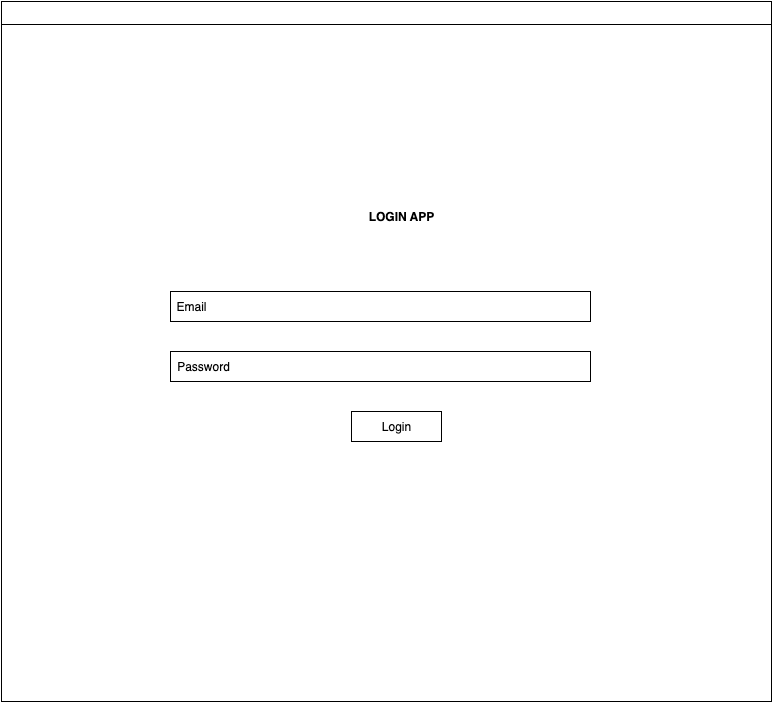
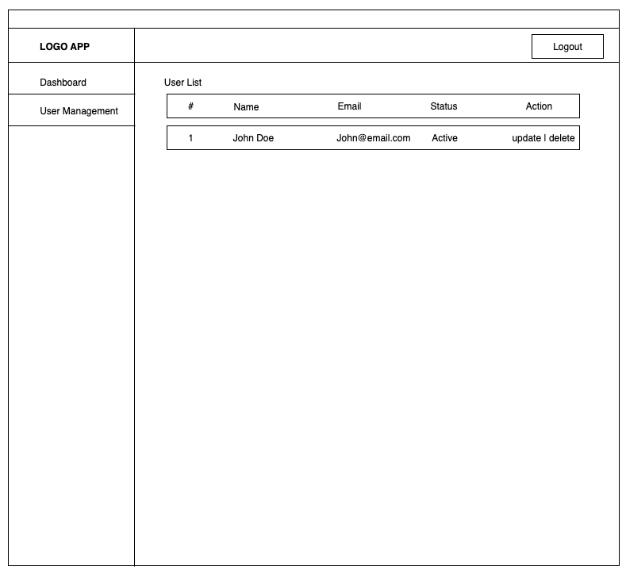

# Take Home Assignment: Fullstack Developer (Vue 2 + Express.js)

## 🎯 Objective

You are required to build a **frontend application** using **Vue 2** based on mockups we provide, and connect it to a custom-built **REST API backend** using **Express.js** width  **MongoDB Database**

The goal is to assess your ability to:
- Translate UI mockups into responsive Vue 2 components
- Build a REST API using Node.js (Express)
- Handle basic authentication and data flow
- Handle basic create/update/delete user 
- Organize clean, scalable code with proper structure
- Docs each function / method
- Docs project

---

## Scope

### Frontend — Vue 2

You will build:
- **Login Page**
- **Dashboard Page** (user registered amount)
- **User Page** (List of user, create user, update user)
- **Item Detail User Page** (view/edit)

The layout should follow the design mockups provided (PNG). Use **Vue CLI** to scaffold your project.

---

### Backend — Express.js

You will implement:
- User login endpoint
- CRUD endpoints for users (GET, POST, PUT, DELETE)
- Basic token-based auth (JWT or mock token)
- Use **MongoDB** database for simulating data persistence.

---

## 🧰 Tech Stack

### Frontend
- Vue 2.x
- Vue Router
- Vuex (optional)
- Axios
- Bootstrap 4

### Backend
- Node.js + Express
- JWT (or any auth middleware)
- CORS enabled
- Body-parser / Express JSON
- MongoDB

---
## 🖼️ Mockup Preview

This is the mockup you should follow:


## Login Page Mockup

## User Page Mockup


## 📄 Create Documentations including Backend API Specs

Example
### 🔐 Authentication

| Method | Endpoint      | Description       |
|--------|---------------|-------------------|
| POST   | `/api/login`  | Login with email & password, return token |
| GET    | `/api/me`     | Get current user info (requires token)    |

**Example response:**
```json
POST /api/login
{
  "email": "user@example.com",
  "password": "123456"
}
⇒
{
  "token": "abc.def.ghi",
  "user": {
    "id": 1,
    "name": "Test User",
    "email": "user@example.com"
  }
}
```


After all finished push it into yout github account and invite this account for review :
- psqanggi